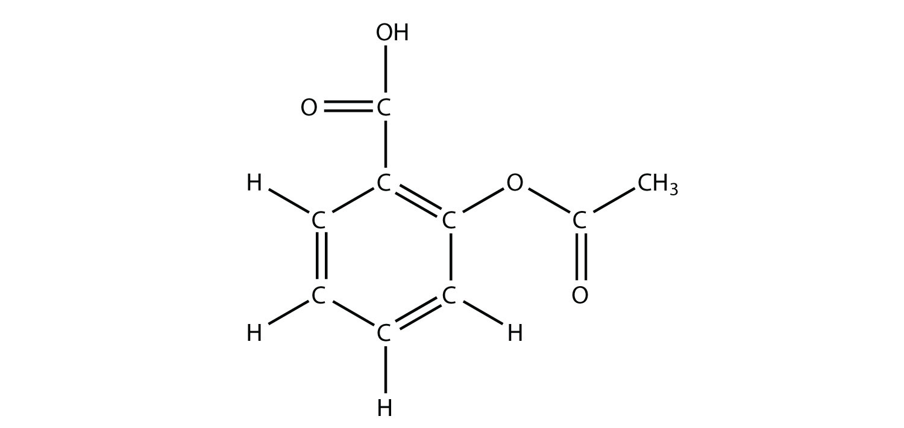
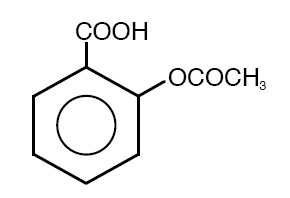
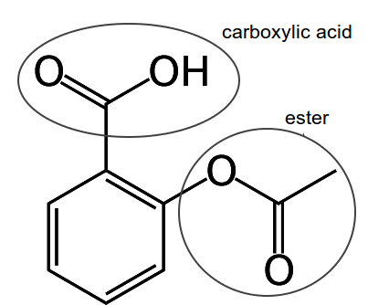

***Head

:::Icon Resources/logos/favicon.ico
:::CSS node_modules/normalize.css/normalize.css minify
:::CSS Resources/styles.css minify
:::Script Resources/scripts/mathjax-conf.js minify
:::Script https://cdn.jsdelivr.net/npm/mathjax@4.0.0/tex-mml-chtml.js
:::Script Resources/scripts/diagcess.js
:::Script Resources/scripts/diagcess-conf.js minify
:::Script Resources/scripts/general-conf.js minify
:::

***

***TitleSlide

:::Title Empowering STEM Learning with SVG
:::Subtitle  Accessible Visualizations for AllSVG for Accessibility
:::
:::Author Volker Sorge and Neha Jadhav
:::

***Affiliations
:::Affiliation
University of Birmingham, UK

[cs.bham.ac.uk/~vxs](https://www.cs.bham.ac.uk/~vxs)
[v.sorge@cs.bham.ac.uk](mailto:v.sorge@cs.bham.ac.uk)
:::

:::Affiliation
Progressive Accessiblity Solutions

[progacc.com](https://progressiveaccess.com)
[v.sorge@progressiveaccess.com](mailto:v.sorge@progressiveaccess.com)
:::

:::Affiliation
Indian Instiute of Technology, Delhi

[iitd.ac.in](https://iitd.ac.in)
:::

*******************

## Overview

Everything we will do today is web based

* Introduction to SVG
* Why SVG for Accessibility
* Examples


## Overview of Web Components

Distinct technologies addressing separate concerns/purposes.

[Separation of Concerns](https://en.wikipedia.org/wiki/Separation_of_concerns)
on the Web:
* [HTML](https://developer.mozilla.org/en-US/docs/Web/HTML) for
  structure
* [CSS](https://developer.mozilla.org/en-US/docs/Web/CSS) for
  presentation/layout
* [JavaScript](https://developer.mozilla.org/en-US/docs/Web/JavaScript) for interactivity/context adaptation
* [SVG](https://developer.mozilla.org/en-US/docs/Web/SVG) for scalable vector
  graphics
* [WAI-ARIA](https://www.w3.org/TR/wai-aria/) for (human-oriented)
  semantics/accessibility


## Bitmap Graphics

Where do my images fit in?

* Most images are bitmap graphics
* **Common formats are** – JPEG, GIF, PNG, BMP, TIFF, ...

{width=600}

* Images can be displayed on the web
* But not really used or manipulated

## **Introduction to SVG**

* **SVG (Scalable Vector Graphics)** is an XML-based format for describing 2D graphics.
* Developed by the **W3C** to enable vector graphics on the web.
* Graphics are described using **XML tags**, making them both human- and machine-readable.
* SVG can be **embedded directly into HTML**, or linked as external files.
* It supports drawing of **basic shapes**, **text**, and more advanced elements.
* **Fully scalable** – maintains crisp quality at any size or resolution.
* Can be styled with **CSS** and made interactive with **JavaScript**.
* Supported by all major modern web browsers.


## **Vector vs Bitmap Graphics**

**Bitmap (Raster)**

* Made up of pixels
* Quality degrades when scaled up
* Better for complex images like photographs

**Vector (e.g., SVG)**

* Based on XML and uses mathematical formulas to define shapes
* Infinitely scalable without loss of quality
* Ideal for logos, icons, illustrations, diagrams
  * In other words: Everything drawn


## **Vector vs Bitmap Graphics (ctd)**

{width=800}


## Display and Output

* Bitmaps are ideal for many output devices
  * Screens
  * Printers
  * ...
* Drawing is more difficult
  * Intermediate points need to be computed
  * Anything that is not straight needs to be interpolated
  * Good anti-aliasing important
  * High resolution helps
* Vectore Graphics is still poor on low resolution devices


## **Elements of SVG**

* `<svg>` – Root element that defines the SVG container
* `<rect>` – Draws rectangles and squares
* `<circle>` – Draws circles
* `<ellipse>` – Draws ellipses (oval shapes)
* `<line>` – Draws straight lines
* `<polyline>` – Draws a connected series of lines
* `<polygon>` – Draws a closed shape with multiple sides
* `<path>` – Draws complex shapes using a series of commands
* `<text>` – Renders text
* `<g>` – Groups SVG elements together
* Attributes: `fill`, `stroke`, `stroke-width`, `transform`, `x`, `y`, `width`, `height`, etc.


## **Advanced SVG Elements**

* **`<clipPath>`**

  * Defines a clipping region – only the part of the element within the path is visible.
  * Useful for masking shapes or creating complex visibility effects.
  * Applied using the `clip-path` attribute.

* **`<mask>`**

  * Similar to `clipPath` but allows **transparency and gradients** for soft masking.
  * Uses black, white, and gray to determine visibility levels.

* **`<pattern>`**

  * Fills a shape with a **repeating graphic** pattern.
  * Can include any SVG content like shapes or images.

* **`<defs>`**

  * Container for **reusable elements** like gradients, patterns, clip paths, etc.
  * Elements inside `<defs>` are not rendered directly but referenced elsewhere.

* **`<symbol>` and `<use>`**

  * `<symbol>` defines reusable graphics.
  * `<use>` creates **instances** of symbols, saving space and allowing multiple uses.

* **`<filter>`**

  * Applies **visual effects** like blur, lighting, color manipulation, etc.
  * Can create complex visual styles (e.g., drop shadows, textures).

* **`<foreignObject>`**

  * Allows inclusion of **HTML or other XML** within SVG.
  * Enables things like embedding HTML-formatted text or CSS-based layouts.

* **`<animate>`, `<animateTransform>`, `<animateMotion>`**

  * Used for **declarative animations** within SVG.
  * Can animate attributes like position, size, color, and transformations.


## **Common Vector Graphics Formats**

* **SVG (Scalable Vector Graphics)**

  * XML-based; widely used on the web
  * Supports interactivity, animation, and styling with CSS/JS
  * Open standard by W3C

* **PDF (Portable Document Format)**

  * Supports both vector and raster graphics
  * Common for print and document sharing
  * Preserves layout and fonts across platforms

* **EPS (Encapsulated PostScript)**

  * Used mainly in professional print workflows
  * Can include both vector and raster data
  * Often used with Adobe Illustrator and similar tools

* **AI (Adobe Illustrator Artwork)**

  * Proprietary format used by Adobe Illustrator
  * Supports layers, artboards, and vector shapes
  * Not directly viewable without Adobe software or converters

* **WMF (Windows Metafile) / EMF (Enhanced Metafile)**

  * Developed by Microsoft for Windows applications
  * Used for vector graphics in Office and Windows apps

* **DXF (Drawing Exchange Format)**

  * Created by Autodesk for CAD (Computer-Aided Design) data
  * Used for exchanging drawings between CAD programs like AutoCAD


## Vector Graphics Formats

* General: SVG, PGF
* Operating System Specific: WMF, EMF
* Proprietary: CDR, AI
* For printing: EPS, PDF

## **Advantages of SVG**

* **Scalability** – No loss of quality at any resolution or zoom level
* **Editability** – Easily editable with code or vector software
* **Smaller File Sizes** – Often smaller than raster files for simple graphics
* **Searchable and Indexable** – Text within SVG is selectable and searchable
* **Interactive** – Supports animations, interactivity via CSS and JavaScript
* **Resolution-independent** – Looks sharp on all devices including Retina displays


## **Drawbacks of SVG**

* **Complexity for Detailed Images** – Not efficient for photorealistic images
* **Performance Issues** – Can be slower with very large or complex SVGs
* **Browser Inconsistencies** – Some older browsers may not support all features
* **Security Risks** – Inline SVGs can pose XSS risks if not sanitized

## Other SVG Issues

**SVG and AI**

* Generative models are good a painting, but not drawing
* There are some **Prompt to Vector** systems out there but none very good
* Image recognition does not work (well) directly from Vector
* Conversion from vector to bitmap is easy, but not the other way around

**SVG and Accessibility**

* Colors and contrasts can not easily be determined
* SVG needs to be drawn first to understand what is next to each other
* Drawing on tactile devices is often poor
  * See the discussion on resolution


## SVG and Accessibility

**The good parts**

* **Lives in the Web**, so we have the full gamut of tools available:
  * CSS, Aria, JavaScript etc.
* **Embedding of information** is easy, via extra markup, different namespaces
* **Grouping of elements** combines visual shapes to semantic groups
* Can be made responsive, animated, etc.


## Reactiveness

## Navigation

## Shadow DOM Style


## Diagramming Language for VI Authors

Work with David Austin{.source}

Basic Aims:

  * Do not forgo the power of TikZ etc.
  * Ease authoring workflow for VI users: Draw, Generate, Inspect
  * XML based for easy  PreTeXt integration
  * Built-in accessibility
  * Little free-hand drawing or placment of labels

Small and descriptive XML vocabulary with well-defined functionality.


## Language Example

``` xml
<graphics id="figure" width="300" height="300" margins="5">
  <boundingbox mbox="[-4,-4,4,4]"/>
  <grid-axes xlabel="x" ylabel="y" />

  <variable name="a" value="1" />
  <function expr="f(x) = exp(x/3)*cos(x)" />

  <group id="graph-tangent">
    <graph id="graph" function="f" stroke="blue" />
    <tangent-line id="tangent" function="f" point="a" stroke="red" />
    <point id="point" p="(a, f(a))" fill="red" text="(a, f(a))" />
  </group>
</graphics>
```


## Examples

* Navigatable Diagrams
  * Mathematics
  * Chemistry
* Sonified Diagrams
* Accessible Data Visualisations: Highcharts
* Animations and Simulations: Phet
* Accessible drawing: PreFigure


## Old Stuff

From here on


## Overview

* Accessibility of STEM on the Web
* Why semantics is important and how to get it
* Emphasize on the hard parts:
  * Formulas
  * Diagrams
  * Graphics
* From authoring to output media

The holy grail: Authoring STEM documents that are fully accessible out of the
box


## Accessibility and the Web{.notes}

* [Web Content Accessibility Guidelines (WCAG)](https://www.w3.org/TR/WCAG21/)
  * ~60 "Success Criteria" across 3 Levels: A, AA, AAA
  * A&AA is the legal basis in most countries, AAA optional/ideal
  * Not just the web but electronic material in general
* WCAG's core principles: POUR
* For **all** users all content must be:
    * Perceivable: Alt text, sub-titles
    * Operable: Keyboard, touch
    * Understandable: Language of a document
    * Robust: Not just for Browser X on OS Y


## Why is STEM Difficult?

Standard recommendations like WCAG fail for STEM content:

* STEM brings together some of the hardest a11y problems
  * Specialised vernacular, scripts, tables, formulas, diagrams
  * Animations,  simulations, Interactive exercises
* STEM are infinite languages
  * meaning shifts, vernacular is added
  * aimed at diverse audiences (pubils, students, scientists)
  * difficult to understand (in particular automatically)
  * precision is important (vague recognition is not enough)
* Declarative approaches fail


## Solutions to STEM

* Historical solutions:
  * Audio recordings, large print, Braille books
  * Use of models, tactile prints, swell paper, etc. in class
  * Exams: Specialist support needs to be provided, often one-on-one
* Curent problems:
  * Most content is in electronic form
  * Anyone can prepare material, often on the fly
  * LMS, independent work, online examinations
  * Interaction, simulations, videos, ...


## Exploit the Structure of the Web{.notes}

Distinct technologies addressing separate concerns/purposes.

[Separation of Concerns](https://en.wikipedia.org/wiki/Separation_of_concerns)
on the Web:
* [HTML](https://developer.mozilla.org/en-US/docs/Web/HTML) for
  structure
* [CSS](https://developer.mozilla.org/en-US/docs/Web/CSS) for
  presentation/layout
* JavaScript for interactivity/context adaptation
* [SVG](https://developer.mozilla.org/en-US/docs/Web/SVG) for scalable vector
  graphics
* [WAI-ARIA](https://www.w3.org/TR/wai-aria/) for (human-oriented)
  semantics/accessibility
* RDF, Owl, etc. for (machine-oriented) semantics


## Aim of my Work

* Use the richness of the Web to make STEM accessible: HTML, CSS, SVG, ARIA...
* Allow learners and practitioners not just to consume but to easily create
* Work and comumincate in their prefered method

**My aim is NOT to**

* restrict authors to a particular syntax/system/technique
* force readers into one system or operating system
* only cater for one output format, teaching style or market
* rely on human input or manual intervention

Generate and embed automatically rich semantic content


## Sourcing Semantics{.notes}

* STEM subjects are living languages
* New concepts created everyday
* Potentially infinite
* Trying to capture this in an declarative standard is impossible
* Human input: Authors? Remedial Officers?
* Automatic
    * Exploit available sources
    * Use intelligent methods to automatically interpret syntax
    * Avoid manual intervention as much as possible

## Example: Let's Start with Maths

Work with Davide Cervone{.source}

$$
   x = \frac{-b \pm \sqrt{b^2-4ac}}{2a}
$$

:::Standalone Click or focus on the formula and press <kbd>ENTER</kbd> to start, <kbd>Escape</kbd> to quit.
:::

* The example uses MathJax for rendering
* Open-source JavaScript library for rendering Mathematics in all browsers
* Input: LaTeX, AsciiMath, and MathML
* Output: HTML/CSS, SVG


## What is MathJax?{.notes}


* [MathJax](https://www.mathjax.org) is an open-source JavaScript library for
    rendering Mathematics in all browsers
* Can take LaTeX, AsciiMath, and MathML as input
* Generates browser output, e.g. HTML/CSS, SVG
*   MathJax is the de facto rendering solution of (nearly) all Mathematics on
    the web
* De facto rendering solution of (nearly) all Mathematics on the web:
    publishers, stackexchange, mediawiki, etc.
*   Around for nearly 15 years
    * lastest stable release: version 3.2.1
    * Version 4.0 is in beta

## Making Math Accessible

* Enrich Math using [Speech Rule Engine](https://speechruleengine.org){target="_blank"}
* Javascript library for translating XML into Speech (markup)
* Open source library [available at github](https://github.com/zorkow/speech-rule-engine){target="_blank"}
* Only Math speech solution in JavaScript
* Runs in browser, command line, as node module.
* Initially implemented in the context of ChromeVox
* Speech solution for: ChromeVox, MathJax, EquatIO, MathLive, ...

## Generate Semantics

* Math markup (e.g., LaTeX, MathML) are not very expressive
* SRE rewrites internally into [semantically improved term structure](https://zorkow.github.io/semantic-tree-visualiser/visualise.html?310000111100%3Cmath%3E%0A%20%20%3Cmi%3Ea%3C/mi%3E%0A%20%20%3Cmsup%3E%0A%20%20%20%20%3Cmi%3Ex%3C/mi%3E%0A%20%20%20%20%3Cmn%3E2%3C/mn%3E%0A%20%20%3C/msup%3E%0A%20%20%3Cmo%3E+%3C/mo%3E%0A%20%20%3Cmi%3Eb%3C/mi%3E%0A%20%20%3Cmi%3Ex%3C/mi%3E%0A%20%20%3Cmo%3E+%3C/mo%3E%0A%20%20%3Cmi%3Ec%3C/mi%3E%0A%20%20%3Cmo%3E%3D%3C/mo%3E%0A%20%20%3Cmn%3E0%3C/mn%3E%0A%3C/math%3E){target="_blank"}

```LaTeX
    ax^2+bx+c=0
```

```html
<math>
  <mi>a</mi>
  <msup>
    <mi>x</mi>
    <mn>2</mn>
  </msup>
  <mo>+</mo>
  <mi>b</mi>
  <mi>x</mi>
  <mo>+</mo>
  <mi>c</mi>
  <mo>=</mo>
  <mn>0</mn>
</math>
```


## Example

$$
   ax^2+bx+c=0
$$

:::Standalone Click or focus on the formula and press <kbd>ENTER</kbd> to start, <kbd>Escape</kbd> to quit.
:::

* Source in LaTeX
* Rendered with MathJax
* Embedded semantics generated with SRE
* Accessibility "built-in"


## Maths Input Solutions

* Direct input with general Math markup
  * LaTeX (generally used by mathematicians)
  * AsciiMath (or similar simplified math markup)
* Example try the [MathJax Page](https://www.mathjax.org/#demo)

Advantages:
* Syntax is readily understood by most mathematicians
* Ascii only input, even for special symbols
* No need to fight with WYSIWYG editors


## Multi-modality

* Speech or Braille output (e.g., Nemeth)
* Linear Braille output
  $$ \vec{\nabla} \times \vec{F} =
            \left( \frac{\partial F_z}{\partial y} - \frac{\partial F_y}{\partial z} \right) \mathbf{i}
          + \left( \frac{\partial F_x}{\partial z} - \frac{\partial F_z}{\partial x} \right) \mathbf{j}
          + \left( \frac{\partial F_y}{\partial x} - \frac{\partial F_x}{\partial y} \right) \mathbf{k}
   $${#braille}

:::Standalone Click or focus on the formula and press <kbd>ENTER</kbd> to start, <kbd>Escape</kbd> to quit.
:::


## Example: LaTeX to Braille

[LaTeX Euro Braille](https://mathjax.github.io/MathJax-demos-web/euro-braille/)

* LaTeX to Braille used in some European countries
* 8 bits is so much smarter than 6 dots!
* Correct LaTeX also on (most) subexpressions.
* No specialist Braille dialects that make learning STEM even harder
* Real solution to inclusive education

## Some Challenging Examples{.notes}

Nemeth is challenging to get right automatically, but sometimes automation is better:

* Subtlety of spaces:
   * $44\,352\,000$ is a single number and transcribes as ⠼⠲⠲⠒⠢⠆⠴⠴⠴
   * $(0110\,1110\,0110)$ is not a single number but a vector, hence ⠷⠼⠴⠂⠂⠴⠀⠼⠂⠂⠂⠴⠀⠼⠴⠂⠂⠴⠾
   * $(n, E) = (451{,}231)$ [The right hand side is not a single number](http://abstract.ups.edu/aata/crypt-exercises.html#grE) ⠷⠝⠠⠀⠠⠑⠾⠀⠨⠅⠀⠷⠲⠢⠂⠠⠀⠆⠒⠂⠾
* Context helps
    $$PAP^{-1} = B$$
    [is not an abbreviation](http://abstract.ups.edu/aata/ssets-ection-sets-and-equivalence-relations.html#mDC): ⠠⠏⠠⠁⠠⠏⠘⠤⠂⠀⠨⠅⠀⠠⠃

## Voicing Complex Content

  $$
  \begin{prooftree}
  \AxiomC{}
  \RightLabel{$Hyp^{1}$}
  \UnaryInfC{$P$}
  \AXC{$P\to Q$}
  \RL{$\to_E$}
  \BIC{$Q^2$}
  \AXC{$Q\to R$}
  \RL{$\to_E$}
  \BIC{$R$}
  \AXC{$Q$}
  \RL{Rit$^2$}
  \UIC{$Q$}
  \RL{$\wedge_I$}
  \BIC{$Q\wedge R$}
  \RL{$\to_I^1$}
  \UIC{$P\to Q\wedge R$}
  \end{prooftree}
  $$

:::Standalone Click or focus on the formula and press <kbd>ENTER</kbd> to start, <kbd>Escape</kbd> to quit.
:::

* Try to express this in MathML


## Current Work{.notes}

* Semantic extraction from context
  * Work with M Balakrishnan and A Bansal, IIT Delhi
  * Concordance analysis and ML
* Self-voicing and synchronised highlighting
* Semi-graphical structures (proofs, graphs, diagrams)
* Improvement to existing rule system
  * Abstract Algebra: Permutations, cycles, cayley tables, etc.
  * Physics: Bra-ket notation, ...
  * Chemistry: info from mhchem package, automatic naming of reactants


## What about STEM Diagrams

* WCAG says: Provide alternative text
* For STEM diagrams this is generally not enough
* Interaction is even more important to explore content
* Automatic recognition works pretty well for "information free" images
* In STEM you need precision

## Example: Chemical Diagrams

:::Diagcess aspirin-multi Resources/molecules/aspirin-multi.svg Resources/molecules/aspirin-multi.xml minify
:::

:::Standalone Click or focus on the diagram and press <kbd>A</kbd> to start, <kbd>Up,Down,Left,Right</kbd> to explore, <kbd>Escape</kbd> to quit.
:::

* Simple navigation model with arrow keys
* I18n support
* SVG allows to embed plenty of semantic. Where do we get it from?


## Example: Aspirin Recognition

{width=600}
{width=300}
{width=300}

* Chemical diagrams come in many flavours
* Basic idea for accessibility
  * Recognise the diagram
  * Generate Scalable Vector Graphics (SVG)
  * Enrich it with semantics for accessibility
* Or start with a chemical identifier


## Semantic Enrichment

{style="float:right"}
*  Take basic chemical markup: Enrich it with derived knowledge and structure it
    accordingly
*  Detect major building blocks of the molecule
    * Aliphatic chains
    * Ring systems: Isolated and fused
    * Functional groups
* Speech generation with common chemical conventions (IUPAC)
* Naming via public databases
* Navigation structure following IUPAC rules


## Abstraction Graph{.notes}

{style="float:right"}

*  Represent molecule as multi-layered graph
*  3-4 layers of abstraction
   *  Molecule
   *  Block
   *  Atom
* Additional layer in case of fused ring systems
* Navigation follows strict chemical (IUPAC) rules


## Web Accessibility Support{.notes}

*  Simple navigation model with arrow keys
*  Screen Reader Support:
    *  Generate speech output on different levels
    *  Display of speech output using subtitling
*  Low Vision/Learning Disability Support:
    *  Highlighting of inspected components
    *  Optional zooming and magnification of components
    *  Changing contrast, colour configurations
*  I18n support


## Complex Molecule Structure

:::Diagcess siramesine Resources/molecules/siramesine.svg Resources/molecules/siramesine.xml minify
:::

:::Standalone Click or focus on the diagram and press <kbd>A</kbd> to start, <kbd>Up,Down,Left,Right</kbd> to explore, <kbd>Escape</kbd> to quit.
:::

* [Other examples](https://progressiveaccess.com/chemistry/)
* Conversion Service: [live.progressiveaccess.com](https://live-staging.progressiveaccess.com)


## Generate with Knowledge{style="margin-bottom:.5em"}

* Easier way to embed knowledge is, if I already know what I am talking about
* [Flowcharts from MS Visio](https://progressiveaccess.com/flowcharts/examples/)
  * Ongoing work with Dedicon (Netherlands)
* [Data Visualisations](https://progressiveaccess.com/physics)
  * From models in R with package BrailleR (with Jonathan Godfrey)
  * [A sonification example](http://127.0.0.1:8080/Progressive/Production/diagram-explorer/samples/)
  * Authors do not even realise that it is accessible out of the box


## Diagramming Language for VI Authors

Work with David Austin{.source}

Basic Aims:

  * Do not forgo the power of TikZ etc.
  * Ease authoring workflow for VI users: Draw, Generate, Inspect
  * XML based for easy  PreTeXt integration
  * Built-in accessibility
  * Little free-hand drawing or placment of labels

Small and descriptive XML vocabulary with well-defined functionality.


## Language Example

``` xml
<graphics id="figure" width="300" height="300" margins="5">
  <boundingbox mbox="[-4,-4,4,4]"/>
  <grid-axes xlabel="x" ylabel="y" />

  <variable name="a" value="1" />
  <function expr="f(x) = exp(x/3)*cos(x)" />

  <group id="graph-tangent">
    <graph id="graph" function="f" stroke="blue" />
    <tangent-line id="tangent" function="f" point="a" stroke="red" />
    <point id="point" p="(a, f(a))" fill="red" text="(a, f(a))" />
  </group>
</graphics>
```


## Diagrams for Screenreading

Generally embeddable into HTML, e.g., these slides

:::Diagcess unitcircle Resources/pretext/roots-of-unity-noscale.svg Resources/pretext/roots-of-unity-noscale.xml minify
:::

:::Standalone Click or focus on the diagram and press <kbd>A</kbd> to start, <kbd>Escape</kbd> to quit, <kbd>Escape</kbd> to quit.
:::


## Data and Charts{.notes}

:::Diagcess mol2 Resources/graphics/Ozone.svg Resources/graphics/Ozone.xml minify
:::

:::Standalone Click or focus on the diagram and press <kbd>A</kbd> to start, arrows to navigate and <kbd>Escape</kbd> to quit.
:::


## PreTeXt: Bringing it All Together

Work by Rob Beezer, David Farmer, et al{.source}

[PreTeXt](https://pretextbook.org/) is a an uncomplicated XML vocabulary for
open source textbooks, monographs, and research articles.

**Aims to bring together the good parts of HTML/Word with LaTeX.**

* Structure in XML
* Mathematics in LaTeX
* Graphics mainly in LaTeX
* [Over 100 individual projects](https://pretextbook.org/catalog.html): Math, CS, engineering, music theory, ...


## PreTeXt and Accessibility

* One source, many outputs:
  * print, PDF, web, EPUB, Jupyter Notebooks, ...
* HTML output is accessible
  * Mathematics is in LaTeX
  * Rendered accessibly with [MathJax](https://www.mathjax.org) and [Speech Rule
    Engine](https://speechruleengine.org)
* Diagrams are harder, **but**{style="color:red"} they are usually decleratively implemented
  * LaTeX packages like TikZ or xyPic
  * with scripts or CAS like Sage

Let's exploit that!

## Tactile Mathematics

Project with PreTeXt, AIM and NFB.{.source}

* Automatic generation of tactile Textbooks
  * PreTeXt books are translated automatically into Braille with
  * Liblouis for the text, SRE for Nemeth
  * [2D layout for complex formulas](https://speech-rule-engine.github.io/sre-tests/output/nemeth/Nemeth2D.html)
  * Tactile diagrams
* Tactile output with
  * Nemeth Braille
  * Nemeth 2D Braille
  * Latex 8 dot Braille (with German institutions)

## Generate Tactile Diagrams

{width=700}
{align="center"}


## The Holy Grail: Hassle-free Accessibility

Work with David Austin, Zainab Ali{.source}

[A recent research paper](https://githubraw.com/zorkow/pretext/w4a2023/w4a2023/frontmatter-1.html)


## Conclusions

* Basic mechanisms for accessible STEM on the web are available
* We just have to use them right
* Do not impede the creativity of authors
* Stay future ready: Preserve as much information as possible
    * Once it is an image the information is lost!
    * When producing formats like MathML __do not throw away your LaTeX__!
* Here we need more emphasis on
    * automatic interpretation,
    * machine learning and understanding
    * implementation of flexible workflows
