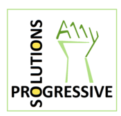
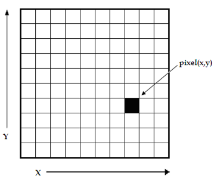
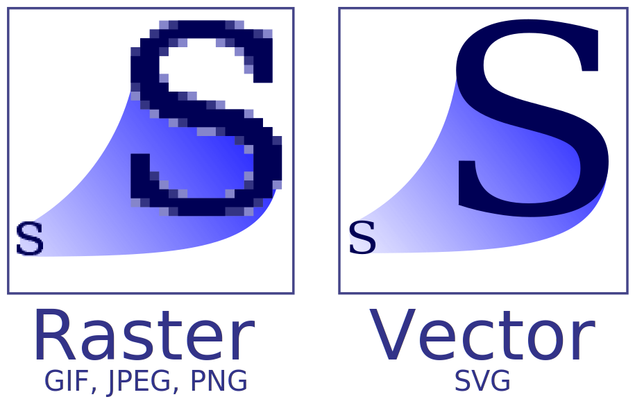
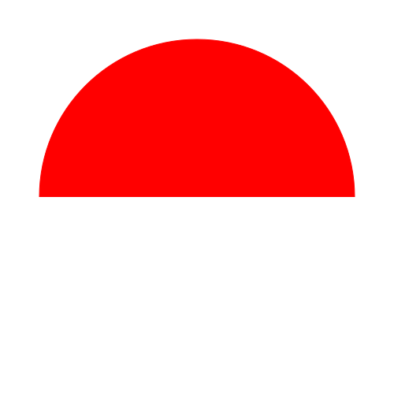
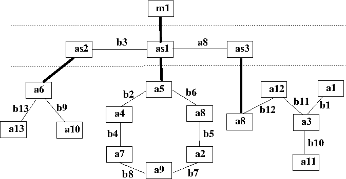
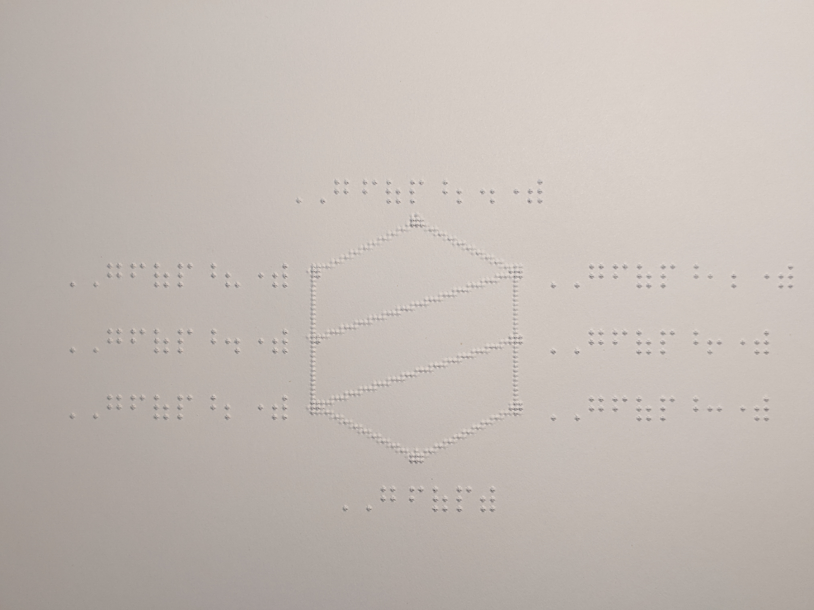
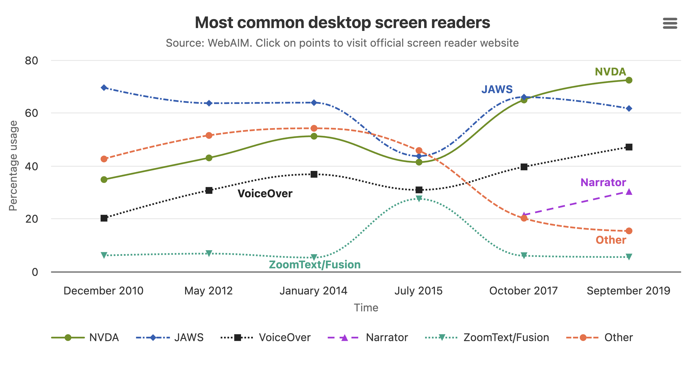

***Head

:::Icon Resources/logos/favicon.ico
:::CSS node_modules/normalize.css/normalize.css minify
:::CSS Resources/styles.css minify
:::Script Resources/scripts/mathjax-conf.js minify
:::Script https://cdn.jsdelivr.net/npm/mathjax@4.0.0/tex-mml-svg.js
:::Script Resources/scripts/diagcess.js
:::Script Resources/scripts/diagcess-conf.js minify
:::Script Resources/scripts/general-conf.js minify
:::

***

***TitleSlide

:::Title Accessible Visualizations for All
:::Subtitle Empowering STEM Learning with SVG
:::
:::Author Volker Sorge and Neha Jadhav
:::

***Affiliations
:::Affiliation
University of Birmingham, UK

[birmingham.ac.uk/](https://www.birmingham.ac.uk/staff/profiles/computer-science/academic-staff/sorge-volker)
[v.sorge@bham.ac.uk](mailto:v.sorge@bham.ac.uk)
:::

:::Affiliation
Progressive Accessiblity Solutions

[progacc.com](https://progressiveaccess.com)
[v.sorge@progressiveaccess.com](mailto:v.sorge@progressiveaccess.com)
[neha.jadhav@progressiveaccess.com](mailto:neha.jadhav@progressiveaccess.com)
:::

:::Affiliation
Indian Instiute of Technology, Delhi

[iitd.ac.in](https://iitd.ac.in)
:::

*******************

## Overview

Everything we will do today is web based

* Introduction to SVG
* SVG for Accessibility
* The challenge of STEM
* SVG as a solution for many problems
* Examples


## Overview of Web Components

Distinct technologies addressing separate concerns/purposes.

[Separation of Concerns](https://en.wikipedia.org/wiki/Separation_of_concerns)
on the Web:
* [HTML](https://developer.mozilla.org/en-US/docs/Web/HTML) for
  structure
* [CSS](https://developer.mozilla.org/en-US/docs/Web/CSS) for
  presentation/layout
* [JavaScript](https://developer.mozilla.org/en-US/docs/Web/JavaScript) for interactivity/context adaptation
* [SVG](https://developer.mozilla.org/en-US/docs/Web/SVG) for scalable vector
  graphics
* [WAI-ARIA](https://www.w3.org/TR/wai-aria/) for (human-oriented)
  semantics/accessibility


## Bitmap Graphics

Where do "normal" images fit in?

{width=600}{style="float:right"}
* Most images are bitmap graphics
* **Common formats are** – JPEG, GIF, PNG, BMP, TIFF, ...
* Images can be displayed on the web
* But not really "used" or manipulated


## **Vector vs Bitmap Graphics**

**Bitmap (Raster)**

* Made up of pixels
* Quality degrades when scaled up
* Better for complex images like photographs

**Vector (e.g., SVG)**

* Uses explicit drawing elements
* Employs mathematical formulas to define shapes
* Infinitely scalable without loss of quality
* Ideal for logos, icons, illustrations, diagrams
  * In other words: Everything drawn


## **Vector vs Bitmap Graphics (ctd)**

Source: Wikipedia{.source}

{width=900}
{align="center"}


## Display and Output

* Bitmaps are ideal for many output devices
  * Screens
  * Printers
  * ...
* Drawing is more difficult
  * Intermediate points need to be computed
  * Anything that is not straight needs to be interpolated
  * Good anti-aliasing important
  * High resolution helps
* Vectore Graphics is still poor on low resolution devices


## **Common Vector Graphics Formats**

* **Web formats**: SVG (Scalable Vector Graphics)
* **General formats**: PGF (Portable Graphics Format)
* **Printer specific formats**: EPS (Encapsulated PostScript), PDF (Portable Document Format)
* **Proprietary formats**: AI (Adobe Illustrator Artwork), CDR (CorelDRAW)
* **Operating system specific**: WMF (Windows Metafile) / EMF (Enhanced Metafile)
* **Application specific**: DXF (Drawing Exchange Format), a CAD formats


## **Introduction to SVG**

* **SVG (Scalable Vector Graphics)** is an XML-based format for describing 2D graphics.
* Developed by the **W3C** to enable vector graphics on the web.
* Graphics are described using **XML tags**, making them both human- and machine-readable.
* SVG can be **embedded directly into HTML**, or linked as external files.
* It supports drawing of **basic shapes**, **text**, and more advanced elements.
* **Fully scalable** – maintains crisp quality at any size or resolution.
* Can be styled with **CSS** and made interactive with **JavaScript**.
* Supported by all major modern web browsers.


## **Elements of SVG**

SVG is an XML document with a set of tags for drawing:

* `<svg>` – Root element that defines the SVG container
* `<rect>` – Draws rectangles and squares
* `<circle>` – Draws circles
* `<ellipse>` – Draws ellipses (oval shapes)
* `<line>` – Draws straight lines
* `<polyline>` – Draws a connected series of lines
* `<polygon>` – Draws a closed shape with multiple sides
* `<path>` – Draws complex shapes using a series of commands
* `<text>` – Renders text
* Attributes: `fill`, `stroke`, `stroke-width`, `transform`, `x`, `y`, `width`, `height`, etc.


## **Advanced SVG Elements**

More advanced elements allow for sophisticated drawing

* `<clipPath>`, `<mask>`
  * Useful for masking shapes or creating complex visibility effects.
  * Only parts of shapes are visible
* `<pattern>`, `<filter>`
  * Fills a shape with a repeating graphic pattern.
  * Applies visual effects like blur, lighting, color manipulation, etc.
  * Can create complex visual styles (e.g., drop shadows, textures).
* `<defs>`, `<symbol>`, `<use>`
  * Defines reusable elements and allowing multiple uses.
* `<foreignObject>` – Allows inclusion of HTML or other XML within SVG.
* `<animate>`, `<animateTransform>`, `<animateMotion>`
  * Used for declarative animations within SVG.
* `<g>` – Groups SVG elements together

## **Advantages of SVG**

* **Scalability** – No loss of quality at any resolution or zoom level
* **Editability** – Easily editable with code or vector software
* **Smaller File Sizes** – Often smaller than raster files for simple graphics
* **Searchable and Indexable** – Text within SVG is selectable and searchable
* **Interactive** – Supports animations, interactivity via CSS and JavaScript
* **Resolution-independent** – Looks sharp on all devices including Retina displays


## **Drawbacks of SVG**

* **Complexity for Detailed Images** – Not efficient for photorealistic images
* **Performance Issues** – Can be slower with very large or complex SVGs
* **Browser Inconsistencies** – Some older browsers may not support all features
* **Security Risks** – Inline SVGs can pose XSS risks if not sanitized

## SVG Issues with AI

* Generative models are good a painting, but not drawing
* There are some **Prompt to Vector** systems out there but none very good
* Image recognition does not work (well) directly from Vector
* Conversion from vector to bitmap is easy, but not the other way around

{width=600}
{align="center"}


## SVG Issues with Accessibility

* Colors and contrasts can not easily be determined
  * WCAG SC 1.4.3 (AA), 1.4.6 (AAA), 1.4.11 (AA)
* SVG needs to be drawn first to understand what is next to each other
* Embossing tactile graphcis often leads to poor output
  * See the discussion on resolution
* Same holds for tactile display devices
  * Often come without SVG driver
* Advanced elements can be difficult to understand

:::Diagcess semicircle Resources/semicircle/semicircle_an2.svg Resources/semicircle/semicircle_an2.xml
:::

## SVG and Accessibility

**The good parts**

* **Lives in the Web**, so we have the full gamut of tools available:
  * CSS, Aria, JavaScript etc.
* **Embedding of information** is easy, via extra markup, different namespaces
* **Grouping of elements** combines visual shapes to semantic groups
* **Animation** Allows for Can be made responsive, animated, etc.
* **Magnification** behaves well for ordinary zoom and can be further animated
* **Reactive** design is possible for automatic adaption to environment or needs

## Reactiveness

* Similar to web pages SVG can be reactive
* Use available techniques of CSS
* Use media queries to react to changes and OS settings
* Example: Allow for different breakpoints
  * breakpoints define viewport width when layout or styling changes
  * important for change of form factors


## Reactiveness and Darkmode Example

{width=600}
{align="center"}


[Equivalent](equivalent.io) Offers a service for SmartSVG generation at
[app.equivalentsvg.io](https://app.equivalentsvg.io)

* Folds multiple graphics wrt breakpoints
* Computes dark modes or color inversions automatically
* Enables color locking and customisation


## STEM and SVG

Now that we know SVG, how can we use it in STEM Accessibility

## Why is STEM Difficult?

Standard recommendations like WCAG fail for STEM content:

* STEM brings together some of the hardest a11y problems
  * Specialised vernacular, scripts, tables, formulas, diagrams
  * Animations,  simulations, Interactive exercises
* STEM are infinite languages
  * meaning shifts, vernacular is added
  * aimed at diverse audiences (pubils, students, scientists)
  * difficult to understand (in particular automatically)
  * precision is important (vague recognition is not enough)
* Declarative approaches fail


## Solutions to STEM

* Historical solutions:
  * Audio recordings, large print, Braille books
  * Use of models, tactile prints, swell paper, etc. in class
  * Exams: Specialist support needs to be provided, often one-on-one
* Curent problems:
  * Most content is in electronic form
  * Anyone can prepare material, often on the fly
  * LMS, independent work, online examinations
  * Interaction, simulations, videos, ...

## SVG Solutions for STEM

* SVG allows to hide information, data, etc.
* We can exploit this to provide additional information to the user via
  * screen reading
  * sonification
  * interaction
  * etc.
* We will:
  * show a few examples
  * explain what's behind them
  * try to make it interactive

## Techniques to Make SVG Accessible

**Simple Techniques**

* Using text instead of drawn characters
* Providing tabindex structures to allow for tabbing through a graphic
* Employ advanced ARIA navigation structures like `tree`, `grid`, etc.

**Advanced Techniques**

* Embedded additional semantics
* Use structure plus Javascript
* Examples:
  * Exploration structures
  * Hidden navigation trees
  * Shadow DOM structures
  * Sonification


## Examples

* Navigatable Formulas
* Navigatable Diagrams
  * Mathematics
  * Chemistry
* Sonified Diagrams
* Accessible Data Visualisations: Highcharts
* Animations and Simulations: Phet
* Accessible drawing: PreFigure


## Interactive Exploration

* There are different ways to achieve this
* Easiest is by adding tabbing structure to the SVG
* Providing ARIA elements
* Bespoke `data` attributes that can be exploited

## Example: Navigatable Formula

Work with Davide Cervone{.source}

$$
   x = \frac{-b \pm \sqrt{b^2-4ac}}{2a}
$$

:::Standalone Click or focus on the formula and press <kbd>ENTER</kbd> to start, <kbd>Escape</kbd> to quit.
:::

* Source in LaTeX
* Rendered with MathJax
* Output is SVG
* Embedded semantics generated produces the speech output
* Exploration follows a [semantic tree structure](https://speech-rule-engine.github.io/semantic-tree-visualiser/visualise.html?110000111100x%20%3D%20%5Cfrac%7B-b%20%5Cpm%20%5Csqrt%7Bb%5E2-4ac%7D%7D%7B2a%7D)


## Navigation

* Interaction using an external navigation structure
* Embedded as foreign element into the SVG
* Navigation is then achieved by mapping navigation to drawn elements
* Some JavaScript for navigation


## Abstraction Graph{.notes}

{style="float:right"}

*  Represent molecule as multi-layered graph
*  3-4 layers of abstraction
   *  Molecule
   *  Block
   *  Atom
* Additional layer in case of fused ring systems
* Navigation follows strict chemical (IUPAC) rules
* Add this graph as formalized as XML to th SVG


## Example: Chemical Diagrams

:::Diagcess aspirin-multi Resources/molecules/aspirin-multi.svg Resources/molecules/aspirin-multi.xml minify
:::

:::Standalone Click or focus on the diagram and press <kbd>A</kbd> to start, <kbd>Up,Down,Left,Right</kbd> to explore, <kbd>Escape</kbd> to quit.
:::

* Simple navigation model with arrow keys
* SVG allows to embed plenty of semantic, including different languages


## Example: Data and Charts

:::Diagcess ozone Resources/graphics/Ozone.svg Resources/graphics/Ozone.xml minify
:::

:::Standalone Click or focus on the diagram and press <kbd>A</kbd> to start, arrows to navigate and <kbd>Escape</kbd> to quit.
:::


## Mathematical Diagrams

* Can be made accessible in a similar fashion
* But they are less well defined
* Consequently most work has been done on xy-graphs
* However, Math diagrams in general are
    * Very subject specific
    * Didactic and Author driven
* Example: A [Network Graph](./diagcess.html?mole=./Resources/prefigure/network)
* Sonification: An [xy graph](./diagcess.html?mole=./Resources/prefigure/network)


## PreTeXt: Accessible Authoring Including Diagrams

Work by Rob Beezer, David Farmer, et al{.source}

[PreTeXt](https://pretextbook.org/) is a an uncomplicated XML vocabulary for
open source textbooks, monographs, and research articles.

**Aims to bring together the good parts of HTML/Word with LaTeX.**

* Structure in XML
* Mathematics in LaTeX
* Graphics mainly in LaTeX or Prefigure
* One source, many outputs:
  * print, PDF, web, EPUB, Jupyter Notebooks, ...
* HTML output is fully accessible

## Bringing is all together: Hassle-free Accessibility

Work with David Austin, Zainab Ali{.source}

[A recent research paper](https://githubraw.com/zorkow/pretext/w4a2023/w4a2023/frontmatter-1.html)


## Tactile Mathematics

Project with PreTeXt, AIM and NFB.{.source}

* Automatic generation of tactile Textbooks
  * PreTeXt books are translated automatically into Braille with
  * Liblouis for the text, SRE for Nemeth
  * [2D layout for complex formulas](https://speech-rule-engine.github.io/sre-tests/output/nemeth/Nemeth2D.html)
  * Tactile diagrams
* Tactile output with
  * Nemeth Braille
  * Nemeth 2D Braille
  * Latex 8 dot Braille (with German institutions)

## Generate Tactile Diagrams

{width=700}
{align="center"}


## Accessible Data Visualisations: What is Highcharts?
* A popular JavaScript charting library for creating interactive charts
* Supports many chart types: bar, line, pie, maps, heatmaps, etc
* Generates charts as SVG (scalable, accessible) in the browser
* Has a built-in Accessibility Module (adds ARIA, keyboard navigation, screen reader text)

## Traditional Charts & Their Challenges
* Static images (PNG/JPEG) pasted into reports or slides
* Excel exports or screenshots
* Canvas-based charts without semantic markup

**Why this is a problem:**
* Not scalable (blurry when zoomed, not responsive)
* Screen readers can’t interpret them – just pixels
* No keyboard navigation (mouse-only interaction)
* No live updates for dynamic data
* Limited alternative text beyond a single 

## Introducing Highcharts

**Bitmap first**

{width=1800}

## Highcharts Line SVG

[Highchart SVG Chart](https://www.highcharts.com/samples/nonav/highcharts/accessibility/accessible-line)

[Highchart Pie Chart](https://www.highcharts.com/samples/nonav/highcharts/accessibility/accessible-pie)

[Highchart Advanced POC](https://highcharts.github.io/highcharts-utils/samples/#gh/dc1050d7a9/sample/highcharts/studies/a11y-interactions)

**Advantages**
* Scalable/ no blur
* Navigate one the same line along x-axis
* Navigate along y-axis
* Can explore every part of SVG
* Comprehension at your pace

## Animations and Simulations: What is PhET?

* A free, research-based interactive simulation platform developed by the University of Colorado Boulder
* Provides browser-based and downloadable simulations for science & math concepts
* Covers topics from elementary level (addition, balance) to advanced (quantum physics, electricity)
* Runs in HTML5/JavaScript – accessible on tablets, Chromebooks and desktop browsers

## Traditional Teaching Methods & Their Challenges

* Static textbook diagrams or chalkboard drawings
* Step-by-step teacher demonstrations with no interactivity
* PowerPoint animations that only “play” but cannot be manipulated

**Why this is a problem:**

* Passive learning — students watch but can’t experiment
* Hard to show cause-and-effect relationships dynamically
* Limited accessibility options (keyboard navigation, screen reader hints)
* Not easily scalable or reusable across different classes/devices


## Shadow DOM Style

Phet simulations use a Shadow DOM approach

* Effectively a DOM that is idependent of the DOM that is displayed
* Since a simulation is an entire page they effecively take over
* Similiar to navigation structure
* But with considerably more fine-grained
  * localised interaction
  * multiple functional components
  * custom events


## Introducing PhET Interactive Simulations

[PhET Interactive Simulations](https://phet.colorado.edu/sims/html/mean-share-and-balance/latest/mean-share-and-balance_all.html)

## Accessible Drawing: What is Prefigure?

* A web-based tool for creating and sharing diagrams and drawings
* Supports semantic annotation of shapes (level-wise)
* Outputs clean SVG or MathML so diagrams are machine-readable
* Study observations

## Traditional Drawing Tools & Their Challenges

* Paper sketches or whiteboards — non-digital, non-shareable
* Graphic software (Illustrator, PowerPoint shapes) — not semantic, export to raster images
* Canvas-based drawing apps — inaccessible to screen readers

**Why this is a problem:**

* People with visual impairments can’t perceive or interact with diagrams
* No alternative text or structural information embedded in images
* Not navigable by keyboard or assistive tech
* Collaboration limited to sighted participants

## Circle

[https://davidaustinm.github.io/prefigure/](https://davidaustinm.github.io/prefigure/)

```xml
<diagram dimensions="(300,300)" margins="5">
  <coordinates bbox="(-5,-5,5,5)">
    <grid/>
    <rectangle at="square" center="(0,0)" dimensions="(4,4)"
               stroke="red" thickness="3" fill="yellow"/>
  </coordinates>
  <annotations>
    <annotation ref="figure"
                text="This diagram shows a grid with a single square centered at the origin">
      <annotation ref="square"
                  text="A square of side length 4 units, drawn with red border and yellow fill"/>
    </annotation>
  </annotations>
</diagram>
```

## Line

```xml
<diagram dimensions="(250,250)" margins="5">
  <coordinates bbox="(-1,-1,1,1)">
    <circle at="circle" center="(0,0)" radius="1" stroke="blue"/>
  </coordinates>
  <annotations>
    <annotation ref="figure"
                text="This diagram shows a circle, centered at the origin">
      <annotation ref="circle"
                  text="The circle"/>
    </annotation>
  </annotations>
</diagram>
```

## Diagramming Language for VI Authors

Work with David Austin{.source}

Basic Aims:

  * Do not forgo the power of TikZ etc.
  * Ease authoring workflow for VI users: Draw, Generate, Inspect
  * XML based for easy  PreTeXt integration
  * Built-in accessibility
  * Little free-hand drawing or placment of labels

Small and descriptive XML vocabulary with well-defined functionality.


## Language Example

```xml
<graphics id="figure" width="300" height="300" margins="5">
  <boundingbox mbox="[-4,-4,4,4]"/>
  <grid-axes xlabel="x" ylabel="y" />

  <variable name="a" value="1" />
  <function expr="f(x) = exp(x/3)*cos(x)" />

  <group id="graph-tangent">
    <graph id="graph" function="f" stroke="blue" />
    <tangent-line id="tangent" function="f" point="a" stroke="red" />
    <point id="point" p="(a, f(a))" fill="red" text="(a, f(a))" />
  </group>
</graphics>
```
